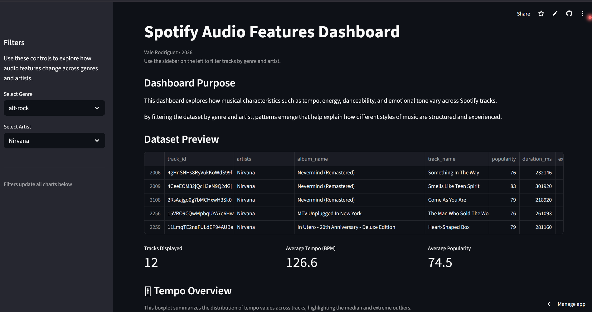

# Spotify Audio Features Dashboard

An interactive **Streamlit** dashboard exploring Spotify tracks' audio features, including tempo, energy, danceability, and valence (emotional tone). 

Use the sidebar to filter by **genre** and **artist** to uncover patterns in musical styles and structure.

---

## 🎯 Dashboard Purpose

This project analyzes how musical characteristics vary across tracks:

- **Tempo:** Shows typical speed ranges and outliers.  
- **Energy vs Danceability:** Dense clusters reveal popular combinations in modern music.  
- **Valence:** Emotional positivity of tracks, highlighting patterns across genres.  
- **Top Tracks:** Lists the most popular songs based on Spotify's popularity metric.

By visualizing these features, the dashboard helps explain why certain songs feel energetic, danceable, or emotionally positive.

---

## 📊 Key Insights

- Most tracks fall into a moderate tempo range, favoring steady, danceable beats.  
- High-energy tracks often have high danceability, while low-energy tracks rarely do.  
- Valence tends to cluster around mid-range values, with extremely happy or sad tracks being less common.  
- Genre filtering shows clear differences in tempo, energy, and valence across musical styles.

---

## 🚀 Live Demo

Try the dashboard yourself here: [Live Dashboard](https://spotify-audio-dashboard.streamlit.app/)

---

## TOOLS USED

- Python  
- Streamlit  
- Pandas  
- Matplotlib  
- Spotify Audio Features Dataset (Kaggle)
